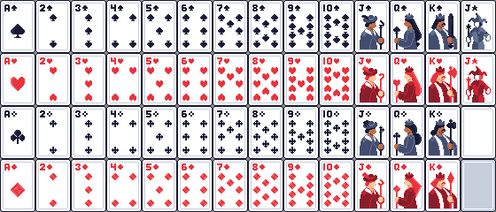

# 🃏 SuitSpell

**SuitSpell** is a desktop app that deals you a random playing card — each card comes with its own unique, thought‑provoking quote.
It’s part fortune‑cookie, part tarot, part pixel‑art eye candy.



---

## ✨ Features

* Draws a random card every time you run it
* Each card has a tailored quote (spades for ambition, hearts for love, clubs for logic, diamonds for glam)
* Simple and minimal GUI (Tkinter)
* Packaged `.exe` available — no Python setup needed

---

## 📦 Download

If you just want to run SuitSpell without installing Python:

1. Download the latest release from the [Releases page](#) (SuitSpell.exe).
2. Double‑click the `.exe` file to launch the app.

---

## 🛠️ Running from Source

If you’d like to run it directly from the code:

### Requirements

* Python 3.9+
* Pillow library (`pip install pillow`)

### Clone and run:

```bash
git clone https://github.com/yourusername/SuitSpell.git
cd SuitSpell
python MAIN.py
```

---

## ⚡ Run on Startup (Windows)

Want SuitSpell to greet you with a card every time you boot up?

1. Press `Win + R`, type `shell:startup`, and hit Enter.
   (This opens the **Startup** folder for your user.)
2. Copy the `SuitSpell.exe` file into this folder.
3. Done! SuitSpell will now launch at startup.

*(For Linux/Mac, use system startup apps or cron jobs — instructions vary by OS.)*

---

## 📸 Screenshots


---

## 🎨 Asset Attribution

The playing card images are **not my own work**. They come from:

**Pixel assets - Playing Cards**

* Author: [Blueeyedrat](https://blueeyedrat.itch.io/)
* Published: June 21, 2021
* Tools: GIMP (inspired by Kenney's playing card assets, with colors mostly from ENDESGA 64)
* License: Free for commercial and non‑commercial use. Attribution requested. Do not re‑sell the assets, even if modified.

The asset pack includes:

* 64×64 PNG sprite sheets (40×60 cards)
* 52 cards + 2 jokers + blank card + card back
* 10 premade color palettes + palette guide
* Alternate card backs

Example use: *Temple Solitaire*.

---

## 🤝 Contributing

Pull requests are welcome!
Want to add new card quotes, more suits, or even alternate art styles? Open an issue or submit a PR.

---

## 📜 License

* **Code**: All rights reserved by the author. You may not copy, modify, or distribute without permission.
* **Card Images**: Copyright © Blueeyedrat. Free for use in projects (see asset license above).
